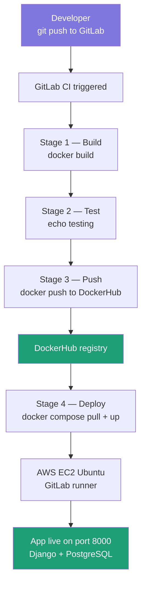
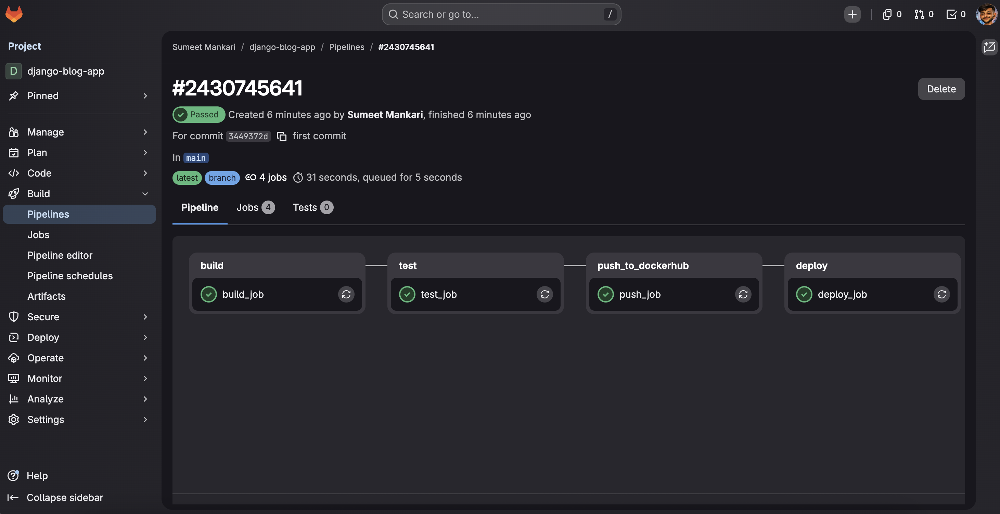

# Django Blog App — CI/CD Pipeline

A Django blog application containerized with Docker and deployed automatically to AWS EC2 using a 4-stage GitLab CI/CD pipeline.

---

## 🏗️ Architecture



---

## 🛠️ Tech Stack

| Layer | Technology |
|---|---|
| Backend | Django 6.x, Python 3.13 |
| Database | PostgreSQL 15 (production), SQLite (development) |
| Containerization | Docker, Docker Compose |
| CI/CD | GitLab CI/CD |
| Container Registry | DockerHub |
| Cloud | AWS EC2 (Ubuntu 24.04) |

---

## 🚀 CI/CD Pipeline

| Stage | Job | What it does |
|---|---|---|
| Build | `build_job` | Builds Docker image using multi-stage Dockerfile |
| Test | `test_job` | Runs test suite |
| Push | `push_job` | Pushes image to DockerHub securely |
| Deploy | `deploy_job` | Pulls latest image and recreates containers on EC2 |

---

## ⚙️ Environment Variables

| Variable | Description | Required |
|---|---|---|
| `USE_POSTGRES` | Set to `"True"` to use PostgreSQL | Yes (production) |
| `POSTGRES_DB` | Database name | Yes |
| `POSTGRES_USER` | Database user | Yes |
| `POSTGRES_PASSWORD` | Database password | Yes |
| `POSTGRES_HOST` | Database host | Yes |
| `POSTGRES_PORT` | Database port | Yes |
| `DJANGO_SECRET_KEY` | Django secret key | Yes |
| `DEBUG` | Set to `"False"` in production | Yes |
| `DOCKERHUB_USER` | DockerHub username (GitLab CI secret) | CI only |
| `DOCKERHUB_PASS` | DockerHub password (GitLab CI secret) | CI only |

> **GitLab CI Secrets**: Go to GitLab → Settings → CI/CD → Variables to add `DOCKERHUB_USER` and `DOCKERHUB_PASS`

---

## 📁 Project Structure

```
django-blog-cicd/
├── .gitlab-ci.yml          # CI/CD pipeline (4 stages)
├── Dockerfile              # Multi-stage Docker build
├── docker-compose.yml      # Container orchestration
├── manage.py               # Django management
├── requirements.txt        # Python dependencies
├── blogs/                  # Django project settings
│   ├── settings.py
│   ├── urls.py
│   └── wsgi.py
├── posts/                  # Blog posts app
│   ├── models.py
│   ├── views.py
│   └── urls.py
├── templates/              # HTML templates
└── docs/                   # Screenshots and diagrams
```

---

## 🖥️ Run Locally

### Prerequisites
- Docker
- Docker Compose v2

```bash
# Clone the repo
git clone https://github.com/sumeet217/Django-blog-cicd.git
cd Django-blog-cicd

# Start all services
docker compose up -d

# Create a superuser
docker exec -it django_app python manage.py createsuperuser

# Visit the app
http://localhost:8000

# Visit the admin panel
http://localhost:8000/admin
```

### Useful Commands

```bash
# Stop the server
docker compose down

# View logs
docker compose logs -f

# Restart containers
docker compose restart

# Wipe everything including database
docker compose down -v
```

---

## ☁️ AWS EC2 Setup

The GitLab runner is hosted on an EC2 instance (Ubuntu 24.04) configured as a shell executor.

```bash
# Install GitLab runner
curl -L https://packages.gitlab.com/install/repositories/runner/gitlab-runner/script.deb.sh | sudo bash
sudo apt-get install gitlab-runner -y

# Add users to docker group
sudo usermod -aG docker ubuntu
sudo usermod -aG docker gitlab-runner

# Install Docker Compose v2
sudo apt-get install docker-compose-plugin -y

# Restart runner
sudo systemctl restart gitlab-runner
```

---

## 📸 Screenshots

> Add your screenshots here after deployment

| Pipeline | App | Admin |
|---|---|---|
|  |  |  |

---

## 📄 License

